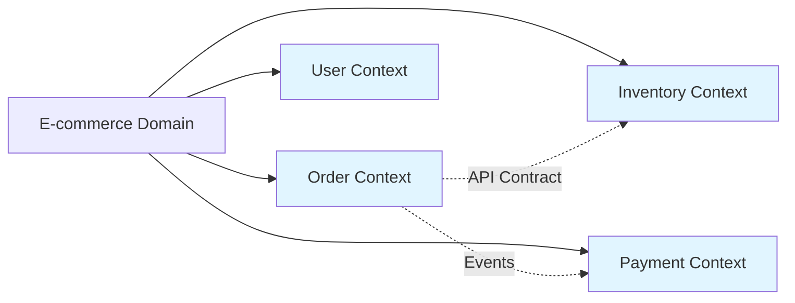

# Backend Architect Skill

Guides developers on best practices for microservices architecture, API versioning strategies, and safe database schema migrations.

## Instructions

### Step-by-Step Process

When invoked, this skill performs the following steps:

**1. Analyze Current Architecture**
   - Scan codebase to understand existing structure (monolith vs. services)
   - Identify module dependencies and coupling points
   - Map data flows between components
   - Detect shared libraries or duplicated logic across modules

**2. Suggest Microservice Boundaries**
   - Apply Domain-Driven Design (DDD) principles:
     - Identify bounded contexts based on business capabilities
     - Separate aggregates by lifecycle and consistency requirements
     - Define service boundaries around cohesive domains
   - Recommend decomposition strategy:
     - Vertical slice (feature-based) for new services
     - Horizontal extraction for shared concerns (auth, logging, etc.)
   - Consider team structure and deployment autonomy

**3. Design API Versioning Strategy**
   Evaluate options and recommend based on use case:

   | Strategy | When to Use | Example |
   |----------|-------------|---------|
   | URI Versioning | Public APIs, clear version lifecycle | `/api/v1/users`, `/api/v2/users` |
   | Header Versioning | Internal APIs, avoid URL pollution | `Accept: application/vnd.myapp.v1+json` |
   | Query Parameter | Quick iteration, debugging friendly | `/users?v=1` |
   | Content Negotiation | RESTful resources with representations | `Accept-Version: 2024-01-01` |

   - Generate versioning code examples for recommended approach
   - Document deprecation timeline and migration path
   - Suggest API gateway configuration if applicable

**4. Design Database Schema Migrations**
   Create safe, reversible migration scripts:

   **Pre-Migration Planning:**
   - Analyze current schema and data volume
   - Identify breaking changes vs. additive changes
   - Estimate downtime impact

   **Migration Script Structure:**
   ```sql
   -- Migration: add_user_roles_table.sql
   -- Up: Create new table with default values
   CREATE TABLE user_roles (
       id SERIAL PRIMARY KEY,
       user_id INTEGER NOT NULL REFERENCES users(id),
       role VARCHAR(50) NOT NULL CHECK (role IN ('admin', 'user', 'moderator')),
       created_at TIMESTAMP DEFAULT CURRENT_TIMESTAMP,
       UNIQUE(user_id, role)
   );

   -- Down: Rollback plan with data preservation option
   DROP TABLE IF EXISTS user_roles;
   -- Optional: preserve role data in audit table before drop
   ```

   **Best Practices:**
   - Use transactional migrations for atomicity
   - Include rollback (down migration) scripts
   - Add indexes during CREATE, not after (for large tables)
   - Support zero-downtime deployments where possible
   - Test migrations on production-like data volumes

**5. Enforce Domain-Driven Design Principles**
   - Define aggregate roots and their invariants
   - Suggest repository patterns for persistence abstraction
   - Recommend event sourcing or CQRS if appropriate
   - Identify shared kernels vs. anti-corruption layers

### Output Format

Provide recommendations in:
- Markdown with structured sections for documentation
- Code blocks for migration scripts, API examples, configuration snippets
- Mermaid diagrams for architecture visualization when helpful

## Activation Phrases / When to Use

Use this skill when you see or type these phrases:

| Phrase | Effect |
|--------|--------|
| `"Design microservices for this app"` | Analyzes monolith and suggests service boundaries with DDD principles |
| `"Suggest API versioning strategy"` | Recommends URI, header, or query-based versioning with implementation examples |
| `"Plan database migration for new schema"` | Creates migration scripts with rollback plans for safe deployments |
| `"Review backend architecture"` | Evaluates current structure and suggests improvements for scalability |
| `"Improve scalability of this backend"` | Identifies bottlenecks and recommends caching, async processing, or sharding |

## Usage Examples

### Design microservices for a monolith e-commerce app

```
user: "Design microservices for this monolith e-commerce app"
skill: Backend Architect analyzes the codebase and suggests decomposing into bounded contexts like Order Service, Inventory Service, Payment Service, and User Service with clear API contracts.
```

**What happens:**
1. Identifies business capabilities in the codebase
2. Maps data dependencies between modules
3. Recommends service boundaries following DDD principles
4. Suggests communication patterns (sync vs. async)
5. Provides architecture diagram and transition roadmap

### Recommend API versioning for /users endpoint

```
user: "Recommend API versioning for /users endpoint"
skill: Analyzes the current API usage and recommends a versioning strategy with code examples for implementation.
```

**What happens:**
1. Reviews existing endpoints and client dependencies
2. Recommends URI, header, or query-based versioning
3. Generates example routes with version handling middleware
4. Documents deprecation policy and migration timeline

### Create safe migration script for adding user roles table

```
user: "Create safe migration script for adding user roles table"
skill: Backend Architect creates a zero-downtime migration plan with rollback support, including up/down scripts and deployment steps.
```

**What happens:**
1. Analyzes current users table structure and data size
2. Designs migration to minimize lock time (add column, backfill, validate)
3. Creates SQL scripts for both directions (up/down)
4. Provides rollback procedure if issues arise during deployment

## How It Works

### Technical Implementation

**1. Codebase Analysis**
- Scans directory structure to identify modules and dependencies
- Parses import statements to map coupling between components
- Identifies shared code that could be extracted as services
- Detects database queries and schema patterns

**2. DDD Application**


**3. Versioning Implementation Patterns**

URI Versioning (Express.js):
```javascript
// api/users/v1/index.js
router.get('/', getUsersV1);

// api/users/v2/index.js
router.get('/', getUsersV2); // Enhanced with includes, filters

// Gateway routing
app.use('/api/users', versionRouter({
  'v1': require('./v1'),
  'v2': require('./v2')
}));
```

Header Versioning (Node.js example):
```javascript
const apiVersion = req.headers['accept-version'] || 'v1';

switch(apiVersion) {
  case 'v1': return handlers.v1;
  case 'v2': return handlers.v2;
  default: return errorUnsupportedVersion();
}
```

**4. Migration Safety Patterns**

Zero-downtime migration pattern:
```sql
-- Step 1: Add column as nullable (no data loss)
ALTER TABLE users ADD COLUMN status VARCHAR(50);

-- Step 2: Backfill existing rows in batches
UPDATE users SET status = 'active' WHERE status IS NULL LIMIT 1000;

-- Step 3: Update application code to use new column
-- Deploy both old and new code (old ignores new column)

-- Step 4: Make column NOT NULL after all instances updated
ALTER TABLE users ALTER COLUMN status SET NOT NULL;

-- Step 5: Remove old columns/legacy code in separate migration
```

### Output Artifacts

| Artifact | Description |
|----------|-------------|
| Service Boundary Diagram | Mermaid chart showing recommended service decomposition |
| API Versioning Strategy | Document with pros/cons and implementation guide |
| Migration Scripts | SQL files for up/down migrations with comments |
| Architecture Recommendations | Markdown document with improvement suggestions |

## Dependencies

- **None required** - Reads code/files directly from repository
- Optional: `mermaid` support for diagram generation (if available in environment)

## Best Practices / Notes

### On Microservices Decomposition

- **Prefer incremental changes over big rewrites** - Extract services gradually rather than attempting a full rewrite
- **Start with vertical slices** - Feature-based extraction is safer than horizontal layer splitting
- **Define clear API contracts** - Services should communicate via well-defined interfaces, not shared databases
- **Consider team boundaries** - Conway's Law: structure services to match team organization

### On API Versioning

- **Always include rollback plans for migrations** - Users can always revert if issues arise
- **Consider backward compatibility for APIs** - Avoid breaking changes when possible; use deprecation periods instead
- **Document version lifecycle** - Clearly communicate support timelines (e.g., "v1 supported for 6 months after v2 release")
- **Use semantic versioning** - Major versions for breaking changes, minor for additive changes

### On Database Migrations

- **Test migrations on production-like data volumes** - Performance issues may not appear with small datasets
- **Keep migrations idempotent** - Scripts should be safe to run multiple times
- **Include checksums or version markers** - Track which migrations have been applied
- **Automate rollback if possible** - CI/CD pipelines should test both up and down migrations

### On Domain-Driven Design

- **Focus on business capabilities, not technical layers** - Services should align with what the business does, not how it's built
- **Define aggregate roots carefully** - Keep aggregates small to reduce locking and improve concurrency
- **Use anti-corruption layers** - Protect bounded contexts from legacy system complexities when integrating

## Error Handling

The skill handles common scenarios gracefully:

| Scenario | Behavior |
|----------|----------|
| Small monolith (under 10k LOC) | Recommends staying monolithic with modular structure; warns against premature microservices |
| No database detected | Provides schema recommendations based on code patterns and suggests initial migrations |
| API already versioned | Analyzes current strategy, identifies improvements or deprecation opportunities |
| Large data volume (>1M rows) | Emphasizes zero-downtime migration techniques and batch operations |

## Integration with Workflow

This skill integrates naturally into development workflows:

- **Before major refactoring**: Get architectural review and decomposition plan
- **When planning new features**: Identify if a new service is warranted
- **Before API changes**: Determine appropriate versioning approach
- **Prior to database schema updates**: Generate safe migration scripts with rollback plans

### Suggested Workflow

```bash
# 1. Analyze current architecture
backend-architect: "Review backend architecture"

# 2. Plan microservices decomposition
backend-architect: "Design microservices for this app"

# 3. Implement API changes with versioning
backend-architect: "Suggest API versioning strategy for /orders"

# 4. Deploy database migration safely
backend-architect: "Plan database migration for adding audit_log table"
```
