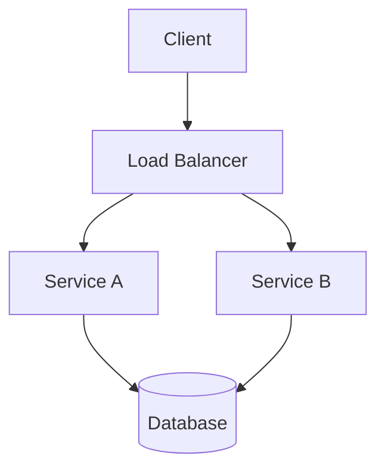
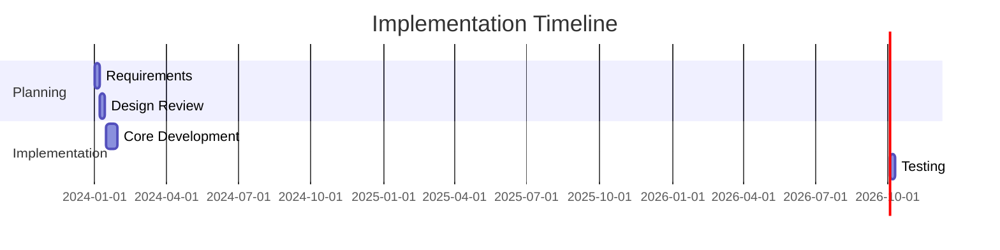
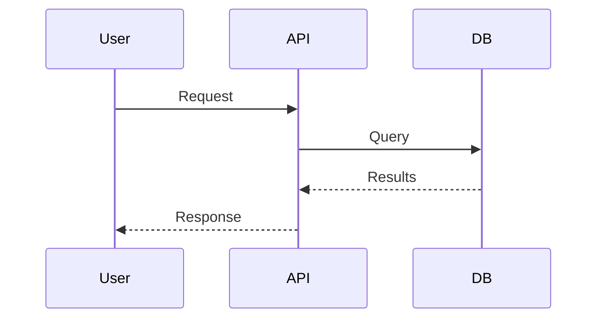

# RFC Creator Skill

Standardizes and generates Request for Comment (RFC) documents to ensure stakeholder alignment on technical decisions, architecture changes, or feature proposals.

## Instructions

Follow these steps to create a complete RFC document:

### Step 1: Read User Proposal or Decision Context
- Parse the user's input to understand the proposed change or decision
- Identify key stakeholders and affected teams
- Extract problem statement and desired outcomes
- Note any constraints, deadlines, or dependencies mentioned

### Step 2: Structure RFC with Standard Sections
Generate an RFC document containing these sections in order:

1. **Title** - Clear, descriptive name of the proposal
2. **Status** - Draft/Active/Approved/Rejected/Live (default: Draft)
3. **Authors** - List primary author(s) and contributors
4. **Stakeholders** - Teams/persons affected or involved in review
5. **Problem Statement** - What problem are we solving? Why now?
6. **Proposed Solution** - Detailed description of the approach
7. **Alternatives Considered** - Other options evaluated and why rejected
8. **Risks and Mitigations** - Potential issues and how to address them
9. **Timeline** - Phased rollout with key milestones
10. **Implementation Plan** - Technical steps, dependencies, effort estimate
11. **Testing Strategy** - How we'll validate the change
12. **Rollback Plan** - Steps to revert if things go wrong
13. **References** - Related documents, RFCs, or research

### Step 3: Generate Clear, Concise Text
- Use active voice and direct language
- Avoid jargon where possible (define unavoidable terms)
- Be specific about metrics and success criteria
- Quantify claims with data when available

### Step 4: Use Markdown Formatting
- Use proper heading hierarchy (`#`, `##`, `###`)
- Use bullet points for lists
- Use tables for comparisons and timelines
- Use code blocks for technical details or configuration examples

### Step 5: Include Diagrams (Mermaid or ASCII)
When helpful, include visual diagrams using Mermaid syntax:

**Architecture Diagram:**


**Timeline Flow:**


**Sequence Diagram:**


### Step 6: Suggest Review Process
Include a review section with recommendations:
- **Primary Reviewers**: Who must approve (2-3 people)
- **Secondary Reviewers**: Teams to notify (optional)
- **Review Timeline**: Expected time for feedback (e.g., 48 hours)
- **Decision Authority**: Who makes final call if consensus fails

### Step 7: Output RFC.md File Ready for GitHub or Team Docs
Generate a complete, ready-to-publish `RFC.md` file that can be:
- Placed directly in the repository's `docs/rfcs/` folder
- Shared as a draft for initial stakeholder feedback
- Used as a template for future RFCs

## Activation phrases / When to use
Use this skill when you need to:
- Create RFC for this architecture change
- Generate Request for Comment document
- Draft RFC for new feature proposal
- Standardize RFC for this technical decision
- Write RFC for database migration plan

## Usage Examples

| Input | Expected Output |
|-------|-----------------|
| "Create RFC for migrating from monolith to microservices" | Complete RFC with phased migration strategy, service boundaries, data consistency approach, and rollback procedures |
| "Draft RFC for adding GraphQL to existing REST API" | RFC comparing REST vs GraphQL trade-offs, schema design, backward compatibility plan, and deprecation timeline |
| "Generate RFC for new authentication system" | RFC covering OAuth/OIDC implementation, migration path for existing users, security considerations, and SSO integration |
| "Standardize RFC for caching layer implementation" | RFC with cache invalidation strategy, consistency models, performance targets, and monitoring approach |

## How it works

```
┌─────────────────────────────────────────────────────────────┐
│                    RFC CREATOR WORKFLOW                     │
├─────────────────────────────────────────────────────────────┤
│                                                             │
│  ┌──────────┐                                               │
│  │ User     │  Input: Problem, solution, context            │
│  │ Proposal │                                                 │
│  └────┬─────┘                                               │
│       ▼                                                     │
│  ┌──────────┐    ┌──────────┐                               │
│  │ Parse &  │──▶│ Extract  │                               │
│  │ Analyze  │    │ Key Info │                               │
│  └────┬─────┘    └──────────┘                               │
│       ▼                                                    │
│  ┌──────────┐    ┌──────────┐                              │
│  │ Generate │──▶│ Structure│                              │
│  │ Content  │    │ Sections │                              │
│  └────┬─────┘    └──────────┘                              │
│       ▼                                                    │
│  ┌──────────┐    ┌──────────┐                              │
│  │ Add      │──▶│ Review & │                              │
│  │ Diagrams │    │ Refine   │                              │
│  └────┬─────┘    └──────────┘                              │
│       ▼                                                    │
│  ┌──────────┐                                              │
│  │ Output   │  RFC.md ready for review                     │
│  │ Final    │                                              │
│  └──────────┘                                              │
│                                                             │
└─────────────────────────────────────────────────────────────┘
```

**Step-by-step process:**
1. **Takes user input** (problem, proposed solution, context)
2. **Structures into standard RFC template** with all required sections
3. **Generates content** with clear language and specific details
4. **Adds placeholders** for diagrams, risks, alternatives as needed
5. **Suggests review process** including assignees and timeline
6. **Outputs RFC.md file** with proper markdown formatting

## Dependencies
- None required (generates markdown text)
- Optional: Mermaid support for diagrams (GitHub natively supports mermaid)

## Best Practices / Notes

### RFC Writing Guidelines
- **Keep RFCs concise** - Aim for 1–3 pages max; link to detailed appendices for deep dives
- **Use clear language** - Avoid jargon where possible; define unavoidable technical terms
- **Include alternatives** - Always document rejected options and why they were chosen over them
- **Always add rollback plan** - Every proposal must include steps to revert the change
- **Store RFCs in docs/rfcs/** - Maintain consistent location for all RFC documents

### Status Lifecycle
RFCs typically progress through these statuses:
1. **Draft** - Initial proposal, seeking early feedback
2. **Active** - Under active review, not yet approved
3. **Approved** - Stakeholders have signed off
4. **Rejected** - Proposal declined (document reasoning for future reference)
5. **Live** - Implementation in progress or completed

### When to Write an RFC
- Major architecture changes
- New feature proposals with significant impact
- API design and interface changes
- Database schema migrations
- Security-related changes
- Process or workflow improvements affecting multiple teams

### Review Process Recommendations
1. Share draft with primary stakeholders before formal review
2. Allow 48 hours for initial feedback on Active RFCs
3. Schedule review meeting if significant discussion needed
4. Document final decision and rationale regardless of outcome
5. Update status as the RFC progresses through lifecycle
