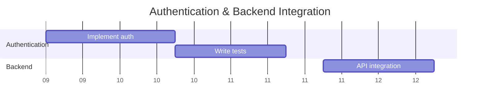
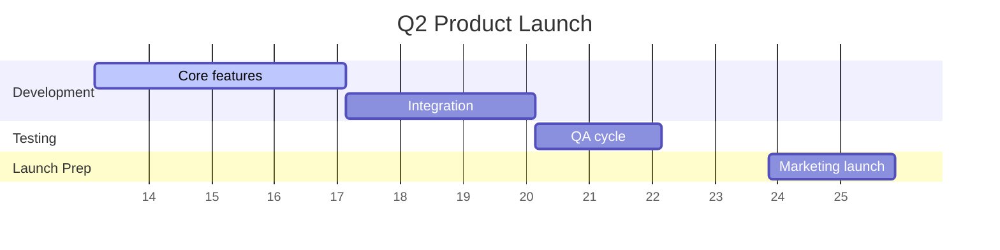

# Roadmap Visualizer Skill

Generates Gantt-style project roadmaps from Jira, Linear, or raw input data (tasks, epics, milestones, dependencies, timelines), outputting visual diagrams (Mermaid or ASCII) and markdown summaries.

## Description

The Roadmap Visualizer skill transforms project planning data into clear, actionable visual roadmaps. It accepts inputs from popular project management tools (Jira, Linear) or raw task lists, then generates structured Gantt charts using Mermaid.js syntax that renders beautifully in GitHub, GitLab, and other markdown viewers. The skill analyzes dependencies to identify the critical path and flags timeline risks like resource conflicts and compression issues.

## Purpose

Project managers and teams often struggle with converting raw task data into visual timelines that stakeholders can understand. This skill helps by:
- **Generating Mermaid Gantt diagrams**: Creates renderable charts for GitHub and other platforms
- **Parsing multiple formats**: Handles Jira exports, Linear data, or plain text descriptions
- **Identifying critical path**: Shows which tasks determine minimum project duration
- **Flagging risks**: Detects resource conflicts, timeline compression, and dependency bottlenecks
- **Structuring task inventory**: Organizes all work items with dates, owners, and dependencies

Ideal for product managers, engineering leads, scrum masters, and project managers planning complex initiatives.

## Features

- **Multi-source input parsing**: Accepts Jira CSV/JSON exports, Linear task lists, or raw text descriptions
- **Automatic date normalization**: Converts relative dates ("Week 1", "Next Monday") to absolute dates
- **Mermaid Gantt generation**: Creates syntax-compatible diagrams that render in GitHub/GitLab
- **Critical path analysis**: Identifies dependency chains and minimum project duration
- **Risk detection**: Flags resource conflicts, timeline compression, gaps, and buffer不足
- **Task inventory tables**: Structured markdown tables with dates, owners, status, dependencies
- **Milestone marking**: Explicitly highlights key dates and deadlines in visualizations
- **Recommendation engine**: Suggests improvements for timeline feasibility

## How to Use

### Installation

```bash
curl -o skills/roadmap-visualizer/SKILL.md https://raw.githubusercontent.com/jalos33/Skill-Cauldron/main/skills/roadmap-visualizer/SKILL.md
```

### Activation Phrases

Use any of these phrases to trigger the skill:
- "Generate roadmap from this Jira data"
- "Create Gantt chart for this project plan"
- "Visualize timeline from Linear tasks"
- "Build roadmap with dependencies and milestones"
- "Show Gantt view of these epics and stories"

### Example Usage

**User**: Generate roadmap from this Jira epic export

```
Key,Summary,Start Date,Due Date,Status,Epic,Assignee
PROJ-101,Implement auth,2024-03-01,2024-03-08,In Progress,Authentication,Jane D.
PROJ-102,Write tests,2024-03-09,2024-03-15,Not Started,Authentication,John S.
```

**Skill Response**: Generates comprehensive report including:
- Gantt chart in Mermaid syntax with Authentication phase
- Task inventory table with all metadata
- Critical path analysis identifying dependencies
- Risk assessment for resource conflicts or timeline issues

---

## Examples

### Example 1: Jira Epic Export

**Input**: User pastes Jira export table or provides CSV data

```csv
Key,Summary,Start Date,Due Date,Status,Epic,Assignee
PROJ-101,Implement auth,2024-03-01,2024-03-08,In Progress,Authentication,Jane D.
PROJ-102,Write tests,2024-03-09,2024-03-15,Not Started,Authentication,John S.
PROJ-103,API integration,2024-03-16,2024-03-22,Not Started,Backend,Alex M.
```

**Output Summary**:

#### Roadmap: Authentication & Backend Integration

**Executive Summary:**
- **Timeline**: March 1 - March 22, 2024 (4 weeks)
- **Milestones**: Auth Complete (Mar 8), Tests Done (Mar 15), API Ready (Mar 22)
- **Total Tasks**: 3, **In Progress**: 1, **At Risk**: 0

**Visual Timeline (Mermaid Gantt):**


**Critical Path**: All tasks form critical path (sequential dependencies)

---

### Example 2: Q2 Product Launch Plan

**Input**: "Create Gantt chart for Q2 product launch plan"

**Output Summary:**

#### Roadmap: Q2 Product Launch

**Executive Summary:**
- **Timeline**: April 1 - June 30, 2024 (13 weeks)
- **Milestones**: Feature Freeze (May 15), Beta Launch (June 1), GA (June 30)
- **Total Tasks**: 18, **In Progress**: 0, **At Risk**: 2

**Visual Timeline Structure:**


**Risk Assessment:**
| Risk | Severity | Recommendation |
|------|----------|----------------|
| Timeline compression in QA phase | Medium | Extend by 3 days or reduce feature scope |
| Marketing launch overlaps with final testing | High | Shift marketing start to June 20 |

---

### Example 3: Linear Tasks with Dependencies

**Input**: User provides Linear task export with dependencies

```
Task Name,Start Date,Due Date,Dependencies
Design system,Mar 1,Mar 8,None
Frontend implementation,Mar 9,Mar 22,Design system completes
Backend API,Mar 9,Mar 22,None
Integration testing,Mar 23,Apr 5,Frontend and Backend complete
```

**Output Summary:**
- Parallel work identified: Frontend and Backend can run simultaneously
- Critical path runs through Design System → Frontend → Integration Testing (10 weeks minimum)
- Recommendation: Backend could start earlier if API contract defined first

## Output Format

The skill generates a structured markdown report containing:

1. **Executive Summary**: Project timeline, milestones, task counts by status
2. **Visual Timeline**: Mermaid Gantt diagram with sections for each epic/phase
3. **Task Inventory**: Structured table with ID, name, phase, owner, dates, duration, status, dependencies
4. **Critical Path Analysis**: List of critical tasks and minimum achievable duration
5. **Risk Assessment**: Table of identified risks with severity and recommendations
6. **Recommendations**: Prioritized action items for improving timeline feasibility

## Best Practices

### When to Use This Skill

- Converting raw task data into visual timelines for stakeholders
- Identifying timeline conflicts before project kickoff
- Planning complex projects with multiple dependencies
- Communicating project status in team meetings or reviews
- Preparing sprint plans from larger epics

### Core Principles

1. **Use Mermaid for compatibility**: Generates diagrams that render in GitHub/GitLab without external tools
2. **Mark milestones explicitly**: Use `milestone` syntax to highlight key dates
3. **Group by sections**: Organize tasks under section headers for readability
4. **Flag resource conflicts**: Always check for overlapping assignments to same owner
5. **Identify critical path**: Show which tasks determine minimum project duration

### Mermaid Gantt Tips

- Use `dateFormat YYYY-MM-DD` for proper parsing
- Apply `axisFormat %W` for week-based display on longer projects
- Keep task labels concise (max 30 characters recommended)
- Use relative durations (`5d`, `2w`) when exact end dates unknown
- Add comments with `#` to explain dependencies in diagrams

## Dependencies

This skill requires no external dependencies. It works entirely with text processing and Mermaid diagram generation. Optional integration with Jira/Linear APIs can be added for direct data fetching if available.

## License

This skill is released under the MIT License. See [LICENSE](https://github.com/jalos33/Skill-Cauldron/blob/main/LICENSE) for details.

---

*Roadmap visualization follows project management best practices from PMBOK and uses Mermaid.js for diagram rendering.*
