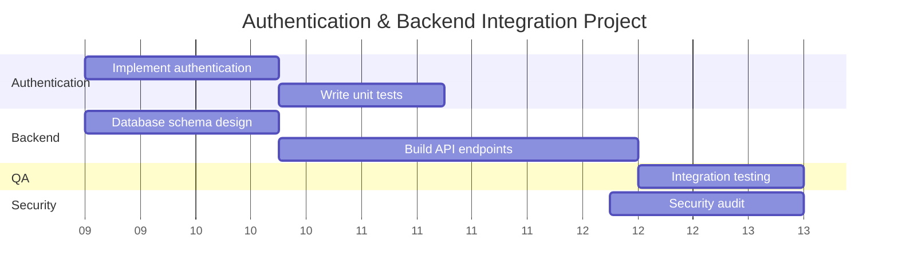

# Roadmap: Authentication & Backend Integration Project

## Executive Summary
- **Timeline**: March 1, 2024 to March 29, 2024 (4 weeks)
- **Milestones**: 
  - Database schema complete (Mar 7)
  - Auth implementation complete (Mar 8)
  - API endpoints ready (Mar 22)
  - Security audit complete (Mar 26)
  - Integration testing complete (Mar 29)
- **Total Tasks**: 6, **Completed**: 1, **In Progress**: 1, **Not Started**: 4

## Visual Timeline (Mermaid Gantt)

## Task Inventory

| # | Key | Task | Phase | Owner | Start | End | Duration | Status |
|---|-----|------|-------|-------|-------|-----|----------|--------|
| 1 | PROJ-104 | Database schema design | Backend | Sarah K. | Mar 1 | Mar 7 | 7 days | Completed |
| 2 | PROJ-101 | Implement authentication | Authentication | Jane D. | Mar 1 | Mar 8 | 7 days | In Progress |
| 3 | PROJ-103 | Build API endpoints | Backend | Alex M. | Mar 9 | Mar 22 | 13 days | Not Started |
| 4 | PROJ-106 | Security audit | Security | Tom L. | Mar 20 | Mar 26 | 7 days | Not Started |
| 5 | PROJ-102 | Write unit tests | Authentication | John S. | Mar 9 | Mar 15 | 6 days | Not Started |
| 6 | PROJ-105 | Integration testing | QA | Mike R. | Mar 23 | Mar 29 | 6 days | Not Started |

## Critical Path Analysis
**Critical Tasks**: PROJ-101 (Auth implementation) -> PROJ-102 (Unit tests) -> PROJ-105 (Integration testing) OR PROJ-104 -> PROJ-103 -> PROJ-105  
**Total Critical Duration**: 26 days (minimum project duration)  
**Bottlenecks Identified**: Integration testing cannot begin until BOTH Authentication and Backend phases complete

## Risk Assessment
| Risk | Task(s) Affected | Severity | Recommendation |
|------|------------------|----------|----------------|
| Timeline compression before integration testing | PROJ-105 (Integration testing) | Medium | Consider extending buffer by 2-3 days |
| Security audit overlaps with Integration planning phase | PROJ-106, PROJ-105 | Low | Parallel work is possible; ensure coordination |

## Recommendations
1. **Start security audit earlier** - Begin on Mar 18 instead of Mar 20 to provide buffer before integration testing deadline
2. **Coordinate QA and Security teams** - Ensure Mike R. (QA) and Tom L. (Security) have aligned testing schedules for Week 4
3. **Consider parallel backend work** - If API endpoints can be partially ready before full schema completion, start earlier than Mar 9

---
*Report generated by Roadmap Visualizer Skill*

