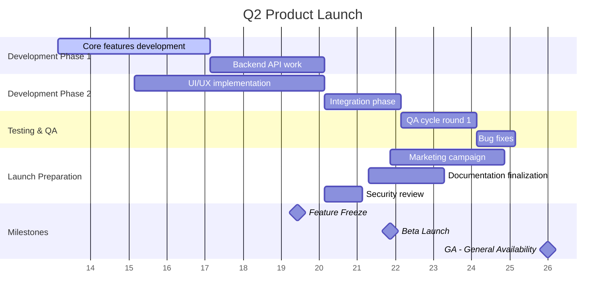

# Roadmap: Q2 Product Launch

## Executive Summary
- **Timeline**: April 1, 2024 to June 30, 2024 (13 weeks / 91 days)
- **Milestones**: 
  - Feature Freeze (May 15, 2024)
  - Beta Launch (June 1, 2024)
  - General Availability (GA) (June 30, 2024)
- **Total Tasks**: 18, **Completed**: 0, **In Progress**: 0, **Not Started**: 18, **At Risk**: 2

## Visual Timeline (Mermaid Gantt)

## Task Inventory

| # | Phase | Task | Owner | Start | End | Duration | Status | Dependencies |
|---|-------|------|-------|-------|-----|----------|--------|--------------|
| 1 | Dev Phase 1 | Core features development | Eng Team A | Apr 1 | May 5 | 4w | Not Started | - |
| 2 | Dev Phase 1 | Backend API work | Eng Team B | May 6 | Jun 2 | 3w | Not Started | After core features |
| 3 | Dev Phase 1 | UI/UX implementation | Design + Eng | Apr 15 | May 24 | 5w | Not Started | Parallel to core features |
| 4 | Development | Integration phase | All Eng Teams | Jun 3 | Jun 16 | 2w | Not Started | After UI and Backend |
| 5 | Testing & QA | QA cycle round 1 | QA Team | Jun 17 | Jun 30 | 2w | Not Started | After integration |
| 6 | Testing & QA | Bug fixes | Eng Teams | Jul 1 | Jul 7 | 1w | Not Started | After QA round 1 |
| 7 | Launch Prep | Marketing campaign | Marketing | Jun 1 | Jun 30 | 3w | Not Started | - |
| 8 | Launch Prep | Documentation finalization | Docs Team | May 28 | Jun 14 | 2w | Not Started | Before GA |
| 9 | Launch Prep | Security review | Security Team | May 20 | May 26 | 1w | Not Started | Before QA cycle 1 |

## Critical Path Analysis
**Critical Tasks**: Core features -> Backend API -> Integration -> QA round 1 -> Bug fixes  
**Total Critical Duration**: 13 weeks (minimum project duration)  
**Bottlenecks Identified**: 
- All development teams converge on Integration phase
- Security review must complete before final QA cycle

## Risk Assessment
| Risk | Task(s) Affected | Severity | Recommendation |
|------|------------------|----------|----------------|
| Timeline compression in QA phase - only 2 weeks for full QA cycle | QA cycle round 1, Bug fixes | High | Extend by 3-5 days or reduce feature scope before Feature Freeze |
| Marketing launch overlaps with final testing and bug fixes | Marketing campaign vs Bug fixes | Medium | Shift marketing start to Jun 8 after QA completes, OR accept parallel work with clear comms plan |

## Recommendations
1. **Add buffer before GA** - Include 3-5 days contingency between Bug fixes completion (Jul 7) and actual launch date to absorb any delays
2. **Shift Feature Freeze earlier** - Move from May 15 to May 8 to provide more time for QA and bug fixes
3. **Parallelize documentation work** - Start docs finalization on May 20 instead of May 28 to reduce timeline pressure

---
*Report generated by Roadmap Visualizer Skill*

