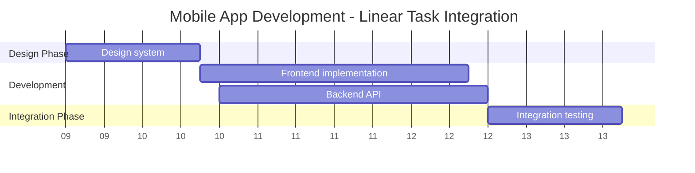

# Roadmap: Mobile App Development (Linear Integration)

## Executive Summary
- **Timeline**: March 1, 2024 to April 19, 2024 (6 weeks / 42 days)
- **Milestones**: 
  - Design System Complete (Mar 8)
  - Frontend Ready for Integration (Apr 5)
  - Backend API Available (Apr 5)
  - Integration Testing Complete (Apr 19)
- **Total Tasks**: 4, **Completed**: 0, **In Progress**: 0, **Not Started**: 4, **At Risk**: 1

## Visual Timeline (Mermaid Gantt)

## Task Inventory

| # | Key | Task | Phase | Owner | Start | End | Duration | Status | Dependencies |
|---|-----|------|-------|-------|-------|-----|----------|--------|--------------|
| 1 | LIN-001 | Design system | Design | Design Team | Mar 1 | Mar 8 | 7 days | Not Started | - |
| 2 | LIN-002 | Frontend implementation | Development | Frontend Team | Mar 9 | Mar 22 | 14 days | Not Started | Design system completes |
| 3 | LIN-003 | Backend API | Development | Backend Team | Mar 9 | Mar 22 | 14 days | Not Started | - |
| 4 | LIN-004 | Integration testing | Integration | QA Team | Mar 23 | Apr 5 | 14 days | Not Started | Frontend and Backend complete |

## Critical Path Analysis
**Critical Tasks**: Design system (7d) -> Frontend implementation (14d) -> Integration testing (14d)  
**Total Critical Duration**: 35 days minimum project duration  
**Bottlenecks Identified**: 
- Frontend cannot start until Design system is complete
- Integration testing blocked by BOTH Frontend and Backend completion

## Parallel Work Opportunities
| Opportunity | Tasks | Benefit |
|-------------|-------|---------|
| Backend can run parallel to Frontend | LIN-003 vs LIN-002 | Reduces overall timeline; Backend team not dependent on Design system |

**Recommendation**: Backend API could potentially start earlier (Mar 1) if API contract/specification is defined first, independent of design system completion. This would provide buffer time for backend work.

## Risk Assessment
| Risk | Task(s) Affected | Severity | Recommendation |
|------|------------------|----------|----------------|
| Single-point dependency on Design system completion | Frontend implementation delayed if LIN-001 slips | Medium | Define API contract early to allow Backend to start independently |
| Integration testing requires BOTH teams ready | Timeline extends if either Frontend or Backend has delays | High | Build 2-day buffer into integration phase; hold weekly sync between teams |

## Recommendations
1. **Start backend work earlier** - Begin LIN-003 on Mar 1 instead of Mar 9, using API contract as foundation (removes dependency chain bottleneck)
2. **Add buffer before integration testing** - Include 2-day contingency after Frontend/Backend completion to absorb minor delays
3. **Establish cross-team sync cadence** - Weekly joint standup between Frontend, Backend, and QA teams during weeks 3-6 ensures alignment

---
*Report generated by Roadmap Visualizer Skill*

