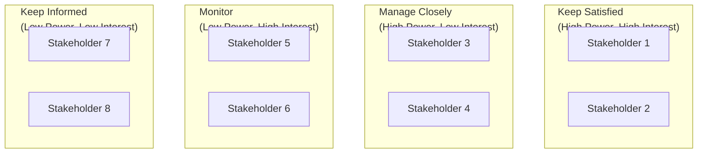
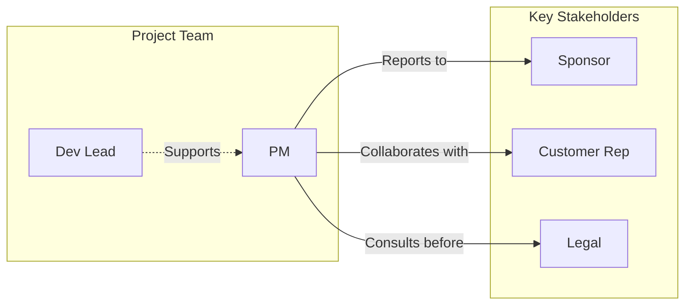

# Stakeholder Mapper Skill

Analyzes project datasets, documents, or user input to generate visual or structured stakeholder relationship maps, influence/power grids, RACI matrices, and engagement strategies.

## Instructions

Follow this structured process to create comprehensive stakeholder analysis:

### Step 1: Parse Input Data and Identify Stakeholders

Read through the provided text (project docs, emails, meeting notes, user lists) and extract all stakeholder mentions:

**Stakeholder Categories:**
- **Individuals**: Named people mentioned in context of project involvement
- **Roles/Positions**: Job titles or functional roles (e.g., "CTO", "Product Manager")
- **Teams/Departments**: Groups involved (e.g., "Engineering Team", "Legal Department")
- **External Parties**: Customers, vendors, regulators, partners

**Extraction Fields:**
For each stakeholder identified, capture:
- Name or identifier
- Role/title
- Organization/team affiliation
- Explicitly stated responsibilities or interests

### Step 2: Assess Stakeholder Attributes

Evaluate each stakeholder across three key dimensions:

**Power (Authority Level):**
- **High**: Can make decisions, approve budgets, allocate resources
- **Medium**: Influences decisions through recommendations or expertise
- **Low**: Limited decision authority, primarily affected by outcomes

**Interest (Engagement Level):**
- **High**: Deeply invested in project success, actively follows progress
- **Medium**: Has stake but not primary driver of activities
- **Low**: Minimal involvement, passively affected by results

**Influence (Connection Power):**
- **High**: Strong cross-functional relationships, can mobilize support or resistance
- **Medium**: Limited network within organization
- **Low**: Isolated from key decision networks

### Step 3: Map Stakeholder Relationships

Document how stakeholders connect to each other and the project:

**Relationship Types:**
- **Reports To**: Direct organizational hierarchy
- **Collaborates With**: Joint work on project components
- **Approves**: Sign-off authority on deliverables
- **Consulted Before**: Must be consulted prior to decisions
- **Impacted By**: Affected by project outcomes (positive or negative)

**Dependency Analysis:**
- Which stakeholders must engage before others can proceed?
- What decisions require multi-stakeholder alignment?
- Where are potential conflict points between stakeholder interests?

### Step 4: Generate Power/Interest Grid

Plot stakeholders on a 2x2 matrix based on power and interest assessments:

```
                    HIGH POWER
                        |
        +---------------+---------------+
        |               |               |
        |   KEEP        |   MANAGE      |
        |   SATISFIED   |   CLOSELY     |
        |   (High Power,|  (High Power, |
        |    High       |   High       |
INTEREST|    Interest)  |   Interest)  |
        |               |               |
        +---------------+---------------+
        |               |               |
        |   MONITOR     |   KEEP        |
        |   (Low Power,|   INFORMED     |
        |    High       |  (Low Power,  |
        |    Interest)  |   Low        |
        |               |   Interest)   |
        +---------------+---------------+
                        LOW POWER
                       LOW INTEREST         HIGH INTEREST
```

**Engagement Strategies by Quadrant:**

| Quadrant | Strategy | Frequency | Approach |
|----------|----------|-----------|----------|
| Keep Satisfied (High Power, High Interest) | Proactive engagement, involve in key decisions | Weekly or on major milestones | Provide detailed updates, seek input early, manage expectations carefully |
| Manage Closely (High Power, Low Interest) | Regular briefings to maintain awareness | Bi-weekly or monthly | Highlight how project affects their goals, minimize time investment required |
| Monitor (Low Power, High Interest) | Keep informed, leverage as advocates | Monthly updates | Share progress through newsletters, involve in user testing, gather feedback |
| Keep Informed (Low Power, Low Interest) | General communications only | Quarterly or on major milestones | Send broad announcements, minimal one-on-one engagement required |

### Step 5: Create RACI Matrix

Develop Responsibility Assignment matrix for project deliverables:

**RACI Definitions:**
- **R (Responsible)**: Does the work, executes tasks
- **A (Accountable)**: Ultimately answerable, has veto power (only ONE per task)
- **C (Consulted)**: Provides input before decisions/actions
- **I (Informed)**: Notified after decisions or actions completed

**RACI Matrix Template:**

| Task/Deliverable | Role 1 | Role 2 | Role 3 | Role 4 | Role 5 |
|------------------|--------|--------|--------|--------|--------|
| Requirement gathering | R | C | A | I | - |
| Technical design | R | C | A | I | - |
| Development | R | - | C | I | - |
| Testing/QA | R | C | - | A | I |
| Deployment | R | C | A | I | - |

**RACI Validation Rules:**
- Every task has exactly ONE "A" (Accountable)
- No tasks without a "R" (Responsible)
- Minimize excessive "C" entries (>3 indicates process bottleneck)
- Ensure "A" has sufficient power to make decisions

### Step 6: Develop Engagement Strategies

Create tailored communication and involvement plans for each stakeholder group:

**Communication Plan Template:**

| Stakeholder | Channel | Frequency | Content Focus | Owner |
|-------------|---------|-----------|---------------|-------|
| [Name/Role] | Email update | Weekly | Progress, blockers, wins | Project Manager |
| [Name/Role] | Status meeting | Bi-weekly | Decisions needed, risks | Team Lead |

**Engagement Actions:**
- **Early phase**: Identify and interview key stakeholders to understand concerns
- **Planning phase**: Collaborative workshops for requirement gathering
- **Execution phase**: Regular status updates, demo sessions for feedback
- **Closing phase**: Retrospective involvement, success celebration

### Step 7: Generate Output Report

Compile comprehensive stakeholder analysis with visualizations:

**Output Components:**
1. Executive summary of key stakeholders and engagement approach
2. Complete stakeholder list with attributes (power, interest, influence)
3. Power/Interest grid visualization (ASCII or Mermaid diagram)
4. Relationship map showing connections between stakeholders
5. RACI matrix for all major deliverables
6. Communication plan with channels and frequencies
7. Action items for stakeholder engagement activities

**Visualization Formats:**

*Mermaid Power/Interest Grid:*


*Mermaid Relationship Map:*


## Activation phrases / When to use

Use this skill when you need to:
- Map stakeholders for this project
- Generate stakeholder influence grid
- Create RACI matrix for this feature
- Analyze stakeholder relationships from these notes
- Suggest stakeholder engagement plan

## Usage Examples

| Input | Expected Output |
|-------|-----------------|
| "Map stakeholders for new payment integration project" | Stakeholder list including Finance team, Legal, External payment processors; Power/Interest grid showing CFO and Compliance as Keep Satisfied; RACI matrix for integration deliverables; engagement plan with weekly finance reviews and monthly legal check-ins |
| "Generate power/interest grid for this feature launch" | Complete stakeholder assessment for all departments involved in feature rollout; 2x2 grid visualization with specific stakeholders placed in each quadrant; tailored engagement strategies per quadrant (e.g., executive sponsor managed closely, end-users monitored) |
| "Create RACI matrix for backend migration" | Detailed RACI assignment for migration tasks (data mapping, API changes, testing, cutover); validation showing single accountable party per task; clear consultation paths for legacy system experts; communication plan for downtime notifications to impacted teams |
| "Analyze stakeholder relationships from recent meeting notes" | Extracted stakeholders from transcript with inferred power/interest based on发言 patterns and decision authority mentioned; relationship map showing collaboration and approval chains identified in discussion; recommendations for additional stakeholder interviews needed |

## How it works

```
+------------------------------------------------------------------+
|                    STAKEHOLDER MAPPING WORKFLOW                   |
+------------------------------------------------------------------+
|                                                                  |
|  STEP 1: PARSE INPUT                                              |
|  +----------------+                                               |
|  | Extract Names, | -> Individuals, roles, teams, external        |
|  | Roles, Teams   |   parties from documents                      |
|  +----------------+                                               |
|           |                                                       |
|           v                                                        |
|  STEP 2: ASSESS ATTRIBUTES                                        |
|  +----------------+    Power (authority), Interest (engagement),  |
|  | Evaluate       |    Influence (connections)                    |
|  | Attributes     |                                               |
|  +----------------+                                               |
|           |                                                       |
|           v                                                        |
|  STEP 3: MAP RELATIONSHIPS                                        |
|  +----------------+    Reports to, collaborates, approves,        |
|  | Relationship   |    consulted, impacted                        |
|  | Mapping        |                                               |
|  +----------------+                                               |
|           |                                                       |
|           v                                                        |
|  STEP 4: POWER/INTEREST GRID                                      |
|  +----------------+    Plot stakeholders on 2x2 matrix; define     |
|  | Power/Interest |    engagement strategies per quadrant          |
|  | Grid           |                                               |
|  +----------------+                                               |
|           |                                                       |
|           v                                                        |
|  STEP 5: RACI MATRIX                                              |
|  +----------------+    Assign Responsible, Accountable,            |
|  | RACI Matrix    |    Consulted, Informed for each deliverable   |
|  +----------------+                                               |
|           |                                                       |
|           v                                                        |
|  STEP 6: ENGAGEMENT STRATEGIES                                    |
|  +----------------+    Communication plan with channels,           |
|  | Engagement     |    frequency, content focus per stakeholder   |
|  | Plan           |                                               |
|  +----------------+                                               |
|           |                                                       |
|           v                                                        |
|  STEP 7: OUTPUT REPORT                                            |
|  +----------------+    Executive summary, visualizations,          |
|  | Generate Report|    action items for engagement activities     |
|  +----------------+                                               |
|                                                                  |
|  OUTPUT: Markdown report with ASCII/Mermaid diagrams and tables  |
|                                                                  |
+------------------------------------------------------------------+
```

**Step-by-step process:**
1. **Parse input data**: Extract stakeholder mentions (names, roles, teams) from documents, emails, meeting notes
2. **Assess attributes**: Evaluate power (authority level), interest (engagement level), influence (connections) for each stakeholder
3. **Map relationships**: Document how stakeholders connect (reports to, collaborates, approves, consulted before, impacted by)
4. **Generate Power/Interest grid**: Plot on 2x2 matrix with engagement strategies (Keep Satisfied, Manage Closely, Monitor, Keep Informed)
5. **Create RACI matrix**: Assign Responsible, Accountable, Consulted, Informed roles for each deliverable; validate single accountable per task
6. **Develop engagement strategies**: Tailored communication plans with channels, frequency, content focus per stakeholder group
7. **Generate output report**: Executive summary, visualizations (ASCII/Mermaid diagrams), tables, and action items

## Dependencies

- None required (text analysis only)
- Optional: Mermaid for visual diagrams (rendered in supported markdown viewers)

## Best Practices / Notes

### Stakeholder Mapping Principles

- **Categorize stakeholders systematically**: Group by internal/external, power/interest to identify patterns and engagement needs
- **Validate map with project sponsor**: Ensure accuracy of power and influence assessments before finalizing engagement approach
- **Update at key project phases**: Revisit stakeholder analysis during major transitions (requirements freeze, design sign-off, pre-launch)
- **Include specific engagement actions**: Every stakeholder should have defined communication frequency and owner

### Power Assessment Guidelines

| Indicator | High Power | Medium Power | Low Power |
|-----------|------------|--------------|-----------|
| Budget authority | Approves project spend | Recommends budget needs | No budget role |
| Decision scope | Final sign-off required | Advisory input only | Affected by decisions |
| Organizational level | Executive/Director | Manager/Senior IC | Individual contributor |

### Interest Assessment Guidelines

| Indicator | High Interest | Medium Interest | Low Interest |
|-----------|---------------|-----------------|--------------|
| Daily involvement | Actively participates in project work | Occasionally consulted | Rarely involved |
| Outcome impact | Direct performance metrics tied to success | Some impact on team goals | Minimal personal impact |
| Time investment | Dedicates significant hours weekly | Occasional meetings or reviews | Minimal time commitment |

### Common Pitfalls to Avoid

| Pitfall | Why It's Bad | How to Avoid |
|---------|--------------|--------------|
| Missing key stakeholders | Critical voices overlooked, later resistance | Conduct stakeholder discovery interviews early; review org charts and past project post-mortems |
| Misjudging power levels | Underestimating influencers creates blockers | Validate with sponsor; observe who gets consulted in decision meetings |
| Too many Accountable roles | Decision paralysis, unclear ownership | Enforce strict ONE "A" per task rule in RACI validation |
| Generic engagement strategies | Low response rates, disengagement | Tailor communication channels and frequency to stakeholder preferences |
| Static stakeholder map | Changes during project lifecycle ignored | Schedule quarterly reviews; update after major organizational changes |

### Communication Channel Guidelines

**Channel Selection by Stakeholder Type:**

| Stakeholder Preference | Recommended Channels | Best For |
|------------------------|---------------------|----------|
| Detailed readers | Email updates, documentation | Keep Informed stakeholders who prefer asynchronous consumption |
| Meeting participants | Status meetings, workshops | Manage Closely stakeholders needing direct engagement |
| Dashboard viewers | BI dashboards, project tools | Monitor stakeholders wanting self-service progress visibility |
| Executive summaries | One-page briefings | Keep Satisfied stakeholders with limited time but high influence |

### RACI Validation Checklist

Before finalizing RACI matrix:
- [ ] Every task has exactly ONE "A" (Accountable)
- [ ] No tasks lack a "R" (Responsible)
- [ ] Each role has balanced load across R/A/C/I assignments
- [ ] Consulted roles are truly necessary (<3 per task ideal)
- [ ] Accountable parties have sufficient authority for decisions
- [ ] All key deliverables covered in matrix

### Engagement Frequency Guidelines

| Quadrant | Recommended Touchpoints | Meeting Types |
|----------|------------------------|---------------|
| Keep Satisfied (High Power, High Interest) | Weekly or milestone-based | Steering committee, decision reviews |
| Manage Closely (High Power, Low Interest) | Monthly or as needed | Quarterly business reviews, escalation points |
| Monitor (Low Power, High Interest) | Bi-weekly to monthly | User testing sessions, feedback workshops |
| Keep Informed (Low Power, Low Interest) | Quarterly or major milestones | All-hands announcements, newsletter updates |
