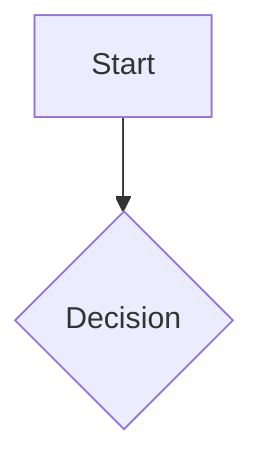

# Workflow Auditor Skill

Analyze existing workflows and processes to identify automation opportunities, bottlenecks, and inefficiencies.

## Purpose

The Workflow Auditor skill helps operations managers, process owners, and productivity enthusiasts systematically analyze business workflows to uncover time-saving automation opportunities. It transforms process descriptions into actionable optimization plans with quantified ROI estimates and specific tool recommendations (Zapier, Make, n8n, GitHub Actions).

## Features

- **Workflow Mapping**: Builds step-by-step maps showing actors, steps, handoffs, wait states
- **Inefficiency Detection**: Identifies manual tasks, bottlenecks, excessive handoffs, repetitive patterns
- **Process Metrics Calculation**: Estimates cycle time, touch time, efficiency ratios, and improvement potential
- **Automation Recommendations**: Suggests specific triggers, actions, and tools for each identified issue
- **ROI Analysis**: Quantifies time savings, implementation costs, and payback periods
- **Phased Implementation Plans**: Prioritizes quick wins vs. complex automations with clear timelines

## How to Use

### Installation

```bash
curl -o ~/.claude/skills/workflow-auditor.skill \
  https://raw.githubusercontent.com/jalos33/Skill-Cauldron/main/skills/workflow-auditor/SKILL.md
```

Or manually copy `SKILL.md` contents to your Claude skills directory.

### Activation Phrases

Use any of these phrases to activate the skill:

- "Audit this workflow for automation opportunities"
- "Analyze this process for inefficiencies"
- "Find repetitive tasks in this flow"
- "Optimize this onboarding workflow"
- "Suggest automation triggers for this process"

### Example Usage

After installation, describe your workflow:

```
Audit employee onboarding workflow for automation

Current process: New hire gets email with welcome packet. HR manually creates IT tickets for laptop setup (takes 2 days per ticket). Manager schedules orientation meeting via calendar email exchange. First-day equipment pickup requires in-person visit to receive badge and credentials.
```

The skill will generate a comprehensive audit report with workflow maps, identified inefficiencies, automation recommendations with specific tools, and ROI calculations.

## Examples

### Employee Onboarding Workflow Audit

**Input:** "Audit employee onboarding workflow for automation"

**Output includes:**

- **Current state map**: 15 steps across HR, IT, Manager departments
- **Identified bottlenecks**: Equipment provisioning (5-day wait), manual ticket creation delays
- **Automation opportunities**: Automated welcome email sequence via Zapier, self-service equipment request form integrated with ITSM tool
- **ROI calculation**: 12 hours per new hire × 50 hires/year = 600 hours annually saved
- **Implementation plan**: Phase 1 quick wins (email automation in week 1), Phase 2 (IT ticket integration month 1)

### Content Publishing Process Analysis

**Input:** "Analyze content publishing process for bottlenecks"

**Output includes:**

- **Workflow map**: Review/approval bottleneck at marketing director level
- **Manual tasks identified**: Copying final content to CMS, manual image upload and optimization, scheduling social media posts across 5 platforms
- **Automation recommendations**: RSS-to-CMS pipeline (n8n), image optimization script (Python), social media scheduler integration (Zapier/Buffer)
- **ROI calculation**: 8 hours/week saved = 320 hours/year, payback in 3 weeks

### Developer Code Review Workflow Optimization

**Input:** "Optimize developer code review workflow"

**Output includes:**

- **Current state analysis**: Manual notification emails, inconsistent review timelines, no automated testing before human review
- **Handoff friction**: 4 handoffs between developer, reviewer, QA, merge queue
- **Automation suggestions**: GitHub Actions for CI/CD (auto-run tests on PR), Slack bot for review requests with SLA tracking, auto-merge for low-risk changes
- **Efficiency metrics**: Cycle time reduction from 3 days to 8 hours projected

### Customer Support Ticket Triage

**Input:** "Find repetitive tasks in customer support ticket handling"

**Output includes:**

- **Repetitive patterns identified**: Manual categorization of tickets, duplicate data entry from email headers, standard response templates copied manually
- **Automation opportunities**: Email parsing with NLP for auto-categorization (Zapier + AI), auto-assignment rules based on keywords and priority, macro expansion for common responses
- **Impact projection**: Triage time reduction from 15 minutes to 3 minutes per ticket

## Output Format

The skill generates a structured markdown report:

```markdown
# Workflow Audit Report: [Process Name]

## Executive Summary
[Brief overview of findings, top opportunities, estimated total savings]

---

## Current State Workflow Map

### Process Overview
- **Total Steps**: [N]
- **Actors Involved**: [List of roles]
- **Estimated Cycle Time**: [X hours/days]
- **Manual Step Percentage**: [Y%]

### Step-by-Step Breakdown
| # | Step | Actor | Estimated Duration | Tool Used | Manual? |
|---|------|-------|-------------------|-----------|---------|

### Workflow Diagram


---

## Identified Inefficiencies

### Manual Tasks Requiring Automation
- **MT-001**: [Description] - [Time per occurrence]

### Bottlenecks and Delays
- **BN-001**: [Location] - Average wait: [Time]

---

## Automation Recommendations

### High Priority (Quick Wins)
| ID | Target Step | Tool Suggested | Trigger | Estimated Savings |
|----|-------------|----------------|---------|-------------------|

**AR-001: [Detailed Recommendation]**
- **Current**: [What happens now]
- **Proposed**: [How automation works]
- **Implementation Steps**: 5-step guide

---

## Estimated ROI

### Time Savings Calculation
- **Annual occurrences**: [Number per year]
- **Time saved per occurrence**: [Hours/minutes]
- **Total annual time savings**: [Hours/days]

### Cost Estimate & Payback Period
- **Tool subscription costs**: $[X]/year
- **Implementation effort**: [Z hours]
- **Payback period**: [X months]

---

## Implementation Plan

### Phase 1: Quick Wins (Weeks 1-2)
| Task | Owner | Duration | Dependencies |
|------|-------|----------|--------------|

[Phases 2 and 3 for medium/complex automations]

---

*Audit conducted by: Workflow Auditor Skill*
```

## Best Practices

### When to Use This Skill

Use the Workflow Auditor when you need to:
- Identify automation opportunities in repetitive business processes
- Reduce cycle time and improve operational efficiency
- Eliminate manual data entry or copy-paste tasks between systems
- Optimize approval workflows and reduce bottlenecks
- Prepare for digital transformation initiatives with ROI justification
- Quantify time savings before investing in automation tools

### Core Principles

1. **Map current state first**: Understand the existing workflow before suggesting changes - don't automate broken processes
2. **Quantify everything**: Estimate time spent, frequency of occurrence, delay durations to enable ROI calculation
3. **Prioritize by impact**: Focus on high-frequency, high-time-cost manual steps first for maximum savings
4. **Validate with stakeholders**: Confirm estimates and recommendations with process owners before implementation
5. **Start small**: Begin with low-risk automations (email triggers, simple workflows) to build confidence

### Automation Tool Selection Guide

| Tool | Best For | Complexity | Cost | Self-Hostable |
|------|----------|------------|------|---------------|
| Zapier | Simple if-this-then-that workflows | Low | $$ | No |
| Make (Integromat) | Complex logic, visual builder | Medium | $$$ | No |
| n8n | Custom workflows, data-heavy | Medium | $-$$ | Yes |
| GitHub Actions | Code repos, CI/CD pipelines | High | Free-$$ | No |
| Custom Scripts | Specialized tasks, legacy systems | High | Variable | N/A |

### Trigger Identification Patterns

**Common Automation Triggers:**
- **New record created**: Form submission, database insert, CRM entry
- **File uploaded**: Document to storage, image to processing queue
- **Status change**: Ticket moved to new stage, order status updated
- **Time-based trigger**: Scheduled daily/weekly/monthly runs
- **Webhook received**: External system event notification
- **Approval granted**: Sign-off completed, review approved

### Efficiency Metrics Explained

| Metric | Definition | Healthy Target |
|--------|------------|----------------|
| Cycle Time | Total duration from start to completion | As low as possible |
| Touch Time | Sum of time spent on active work steps | N/A |
| Wait Time | Duration in queues or awaiting approvals | Minimize |
| Efficiency Ratio | Touch Time / Total Cycle Time | >50% |
| Handoff Count | Number of role transitions | Lower is better |

### Common Pitfalls to Avoid

| Pitfall | Why It's Problematic | Better Approach |
|---------|---------------------|-----------------|
| Automating broken processes | Speeds up inefficiencies rather than fixing them | Optimize workflow first, then automate |
| Over-automation of exceptions | Complex edge cases make automation brittle | Focus on standard flow; handle exceptions manually |
| Ignoring human oversight | Complete automation without validation risks errors | Keep human review for critical decisions |
| Underestimating maintenance | Automation requires monitoring and updates | Allocate time for ongoing maintenance in planning |

## License

MIT License

See [SKILL.md](SKILL.md) for full license text.

## Repository

This skill is part of the Skill-Cauldron project: https://github.com/jalos33/Skill-Cauldron
