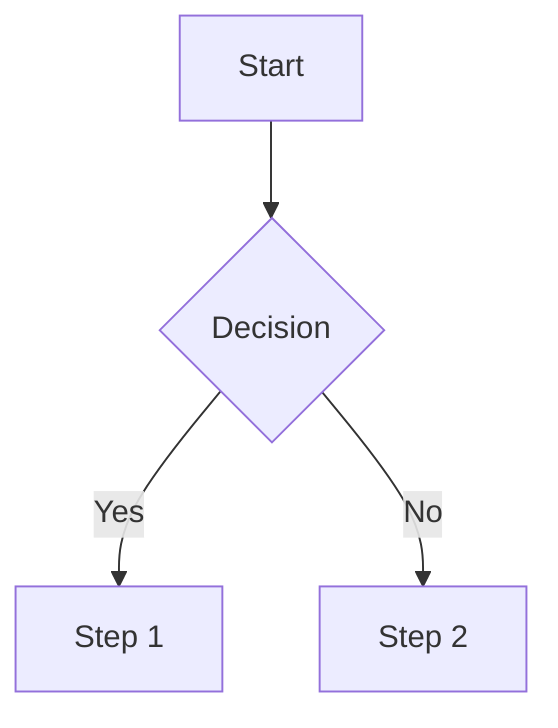

# Workflow Auditor - Analysis Instructions

## Purpose

The Workflow Auditor skill systematically analyzes existing workflows or processes to identify repetitive manual tasks, bottlenecks, inefficiencies, and suggests specific automation opportunities with tools like Zapier, Make, n8n, GitHub Actions, and custom scripts. It transforms process descriptions into actionable optimization plans with quantified time savings and ROI estimates.

## How It Works

1. **Parse Input Text/Flow Description**: Extract all steps, actors, decision points, inputs/outputs from the provided workflow description
2. **Build Step-by-Step Workflow Map**: Create structured representation showing sequence, parallel paths, handoffs, wait states
3. **Identify Pain Points**: Detect manual steps requiring human intervention, delays/wait times, excessive handoffs between roles, repetitive actions across multiple cases
4. **Calculate Metrics**: Estimate cycle time, touch time vs. wait time, efficiency ratio (touch time / total cycle time)
5. **Suggest Automation Opportunities**: Recommend specific triggers, actions, and tools for each identified inefficiency
6. **Estimate Time Savings & ROI**: Quantify potential time savings per occurrence and annualized impact based on frequency
7. **Output Structured Report**: Generate markdown report with current workflow map (Mermaid/ASCII), inefficiencies list, automation recommendations, implementation plan

## Step-by-Step Analysis Process

### Step 1: Extract Workflow Elements
From the input description, identify:
- **Steps**: All discrete actions in the process
- **Actors/Roles**: Who performs each step (e.g., HR Manager, Developer, Customer Support)
- **Decision Points**: Where branching occurs based on conditions
- **Inputs/Outputs**: Data/documents entering and leaving each step
- **Dependencies**: What must complete before a step can begin

### Step 2: Map Current State Workflow
Create a structured workflow map showing:
- Sequential flow of steps (step numbers, descriptions)
- Actor assignments for each step
- Handoff points between actors/departments
- Wait states/delays between steps
- Decision branches and their conditions
- Tools/systems used at each step

### Step 3: Identify Inefficiencies
Categorize detected issues into:

**Manual Tasks**: Steps requiring human intervention that could be automated
- Data entry/rekeying across systems
- Copy-paste operations between applications
- Manual file transfers or uploads
- Email-based approvals or notifications

**Bottlenecks**: Points causing delays or backlogs
- Single-point dependencies (only one person can approve)
- Long wait times for external responses
- Resource contention (shared tools/people)
- Queue buildup at specific steps

**Handoff Friction**: Excessive transitions between actors
- Steps requiring approval/sign-off from multiple roles
- Context switching when tasks pass between teams
- Communication overhead coordinating handoffs

**Repetitive Patterns**: Actions performed identically across many cases
- Same validation checks repeated for each case
- Duplicate data collection from different sources
- Standardized responses to common scenarios

### Step 4: Calculate Process Metrics
Estimate key performance indicators:
- **Total Cycle Time**: End-to-end duration from start to finish
- **Touch Time**: Sum of time spent on active work steps
- **Wait Time**: Duration in queues or awaiting approvals
- **Efficiency Ratio**: Touch Time / Total Cycle Time (higher = better)
- **Handoff Count**: Number of role transitions
- **Manual Step Percentage**: Steps requiring human intervention

### Step 5: Generate Automation Recommendations
For each inefficiency, suggest specific automation approaches:

**Trigger Types to Consider:**
- **Time-based**: Scheduled runs (daily at 9 AM, weekly on Monday)
- **Event-driven**: Occurs when something happens (new file uploaded, form submitted)
- **Approval-based**: Waits for human action before continuing
- **Data-change**: Activated when specific field values change

**Automation Tools to Recommend:**
- **Zapier**: Simple if-this-then-that workflows, broad app integrations
- **Make (Integromat)**: Visual automation builder with complex logic
- **n8n**: Self-hostable workflow automation, node-based editor
- **GitHub Actions**: CI/CD pipelines, code repository event triggers
- **Custom Scripts**: Python/bash scripts for specialized tasks
- **RPA Tools**: UiPath, Automation Anywhere for legacy system interaction

### Step 6: Estimate Time Savings & ROI
Quantify impact of each automation:
- **Time per occurrence**: Minutes/hours saved each time workflow runs
- **Frequency**: How often the workflow executes (daily, weekly, monthly)
- **Annual savings**: Time × frequency × working days/year
- **Cost estimate**: Tool subscription costs, implementation effort
- **ROI**: Annual time value / implementation cost

### Step 7: Create Implementation Plan
Structure recommendations into phased rollout:
- **Phase 1 (Quick Wins)**: Low-risk, high-impact automations implementable in <1 week
- **Phase 2 (Foundational)**: Medium complexity requiring setup/integration work
- **Phase 3 (Advanced)**: Complex multi-system automations or custom development

## Output Format

The skill generates a comprehensive markdown report:

```markdown
# Workflow Audit Report: [Process Name]

## Executive Summary
[Brief overview of findings, top opportunities, estimated total savings]

---

## Current State Workflow Map

### Process Overview
- **Total Steps**: [N]
- **Actors Involved**: [List of roles]
- **Estimated Cycle Time**: [X hours/days]
- **Manual Step Percentage**: [Y%]

### Step-by-Step Breakdown
| # | Step | Actor | Estimated Duration | Tool Used | Manual? |
|---|------|-------|-------------------|-----------|---------|
| 1 | [Description] | [Role] | [Time] | [System] | Yes/No |

### Workflow Diagram


---

## Identified Inefficiencies

### Manual Tasks Requiring Automation
- **MT-001**: [Description] - [Time per occurrence] - Frequency: [X/week]
  - Current process: [What happens now]
  - Impact: [Why this matters]

### Bottlenecks and Delays
- **BN-001**: [Location in workflow] - Average wait: [Time]
  - Root cause: [Single approver, external dependency, etc.]
  - Impact on cycle time: [How much it delays completion]

### Excessive Handoffs
- **HF-001**: Between [Role A] and [Role B] at step [N]
  - Communication overhead: [Time spent coordinating]
  - Risk: [Errors, delays, context loss]

### Repetitive Patterns
- **RP-001**: [Description of repeated action]
  - Occurs in every case: [Yes/No]
  - Opportunity for standardization: [How to automate]

---

## Automation Recommendations

### High Priority (Quick Wins)
| ID | Target Step | Automation Type | Tool Suggested | Trigger | Estimated Savings |
|----|-------------|-----------------|----------------|---------|-------------------|
| AR-001 | [Step #] | [Type] | [Tool] | [Trigger] | [Time/week] |

**AR-001: [Detailed Recommendation]**
- **Current**: [What happens now manually]
- **Proposed**: [How automation would work]
- **Implementation Steps**:
  1. Set up [tool/account]
  2. Configure trigger: [specific condition]
  3. Define actions: [sequence of automated actions]
  4. Test with sample data
  5. Deploy and monitor

**Recommended Tools:**
- **Primary**: [Zapier/Make/n8n/GitHub Actions/script] - Why: [reason]
- **Alternative**: [Other option] - When to use instead: [scenario]

### Medium Priority (Foundational)
[Similar format for medium-complexity automations]

### Low Priority (Advanced)
[Complex multi-system automations or custom development]

---

## Process Metrics Summary

| Metric | Current Value | Target After Automation | Improvement |
|--------|---------------|------------------------|-------------|
| Total Cycle Time | [X days/hours] | [Y days/hours] | [Z% reduction] |
| Touch Time | [X hours] | [Y hours] | [Z% reduction] |
| Wait Time | [X hours] | [Y hours] | [Z% reduction] |
| Efficiency Ratio | [X%] | [Y%] | [+Z percentage points] |
| Manual Steps | [N steps] | [M steps] | [-K steps] |

---

## Estimated ROI

### Time Savings Calculation
- **Annual occurrences**: [Number per year]
- **Time saved per occurrence**: [Hours/minutes]
- **Total annual time savings**: [Hours/days per year]

### Cost Estimate
- **Tool subscription costs**: $[X]/month = $[Y]/year
- **Implementation effort**: [Z hours] at $[rate]/hour = $[cost]
- **Maintenance overhead**: ~[W hours/month]

### ROI Summary
- **First-year net savings**: [Time value - implementation cost - subscription costs]
- **Payback period**: [X months]
- **Break-even point**: [When cumulative savings exceed costs]

---

## Implementation Plan

### Phase 1: Quick Wins (Weeks 1-2)
| Task | Owner | Duration | Dependencies |
|------|-------|----------|--------------|
| Set up automation account | [Name] | 1 day | None |
| Configure trigger AR-001 | [Name] | 4 hours | Account setup complete |
| Test and deploy | [Name] | 2 hours | Configuration complete |

**Success Criteria**: [Measurable outcome for Phase 1 completion]

### Phase 2: Foundational (Weeks 3-6)
[Similar table for medium-complexity items]

### Phase 3: Advanced (Months 2-3)
[Complex automations requiring development or cross-system integration]

---

## Risk Assessment and Mitigations

| Risk | Probability | Impact | Mitigation Strategy |
|------|-------------|--------|---------------------|
| Automation introduces errors | Low | Medium | Implement validation checks; maintain human review for critical steps |
| Tool dependency creates single point of failure | Medium | Low | Document manual fallback procedures; use redundant tools where critical |
| Resistance to change from team members | High | Medium | Involve users in automation design; demonstrate time savings benefits |
| Integration with legacy systems fails | Medium | High | Pilot with subset of cases first; maintain parallel manual process during transition |

---

## Next Steps and Questions

### Information Needed Before Implementation
1. [Specific question about current tool stack or constraints]
2. [Clarification on approval authority or decision rights]
3. [Budget availability for automation tools]

### Recommended Immediate Actions
1. Review this audit with process owner and team members
2. Prioritize Phase 1 items based on resource availability
3. Select automation platform (Zapier vs Make vs n8n) based on existing subscriptions
4. Schedule kickoff meeting to assign owners for Phase 1 tasks

---

*Audit conducted by: Workflow Auditor Skill*
*Date: YYYY-MM-DD*
*Input source: [Description of provided workflow documentation]*
```

## Best Practices

### When to Use This Skill
Use the Workflow Auditor when you need to:
- Identify automation opportunities in repetitive business processes
- Reduce cycle time and improve process efficiency
- Eliminate manual data entry or copy-paste tasks
- Optimize approval workflows and reduce bottlenecks
- Prepare for digital transformation initiatives
- Quantify ROI before investing in automation tools

### Core Principles

1. **Map current state first**: Understand the existing workflow before suggesting changes
2. **Quantify everything**: Estimate time spent, frequency of occurrence, delay durations
3. **Prioritize by impact**: Focus on high-frequency, high-time-cost manual steps first
4. **Validate with stakeholders**: Confirm estimates and recommendations with process owners
5. **Start small**: Begin with low-risk automations to build confidence and learn

### Automation Tool Selection Guide

| Tool | Best For | Complexity | Cost | Self-Hostable |
|------|----------|------------|------|---------------|
| Zapier | Simple workflows, broad integrations | Low | $$ | No |
| Make (Integromat) | Complex logic, visual builder | Medium | $$$ | No |
| n8n | Custom workflows, data-heavy | Medium | $-$$ | Yes |
| GitHub Actions | Code repos, CI/CD, developer workflows | High | Free-$$ | No |
| Custom Scripts | Specialized tasks, legacy systems | High | Variable | N/A |

### Trigger Identification Patterns

**Common Automation Triggers:**
- **New record created**: Form submission, database insert, CRM entry
- **File uploaded**: Document to storage, image to processing queue
- **Status change**: Ticket moved to new stage, order status updated
- **Time-based trigger**: Scheduled daily/weekly/monthly runs
- **Webhook received**: External system event notification
- **Approval granted**: Sign-off completed, review approved

### Efficiency Metrics Explained

**Cycle Time**: Total duration from workflow start to completion
**Touch Time**: Sum of time spent on active work steps (excludes waits)
**Wait Time**: Duration in queues, awaiting approvals, or external responses
**Efficiency Ratio**: Touch Time / Total Cycle Time (target: >50% for healthy processes)
**Handoff Count**: Number of role transitions (lower is better; each handoff adds risk and delay)

### Common Pitfalls to Avoid

| Pitfall | Why It's Problematic | Better Approach |
|---------|---------------------|-----------------|
| Automating broken processes | Speeds up inefficiencies rather than fixing them | Optimize workflow first, then automate |
| Over-automation of exceptions | Complex edge cases make automation brittle | Focus on standard flow; handle exceptions manually |
| Ignoring human oversight | Complete automation without validation risks errors | Keep human review for critical decisions |
| Underestimating maintenance | Automation requires monitoring and updates | Allocate time for ongoing maintenance in planning |

### Review Process

1. **Initial audit**: Run skill analysis on process documentation
2. **Validation workshop**: Present findings to process owners and team members
3. **Refine estimates**: Adjust time estimates based on stakeholder feedback
4. **Prioritize together**: Collaboratively select Phase 1 items
5. **Pilot implementation**: Test one automation before scaling
6. **Measure results**: Track actual vs. estimated savings after deployment
7. **Iterate**: Use learnings to inform next phase of optimization

## Example Analysis

### Employee Onboarding Workflow Audit

**Input**: Description of current onboarding process involving HR, IT, Manager

**Output includes:**
- Current state map showing 15 steps across 4 departments
- Identified bottlenecks: equipment provisioning (5-day wait), account setup (manual tickets)
- Automation opportunities: automated welcome email sequence, self-service equipment request form
- Estimated savings: 12 hours per new hire × 50 hires/year = 600 hours annually
- Implementation plan with Phase 1 quick wins (email automation in week 1)

### Content Publishing Process Analysis

**Input**: Steps from content creation to multi-channel distribution

**Output includes:**
- Workflow map showing review/approval bottlenecks
- Manual tasks: copying content to CMS, uploading images, scheduling social posts
- Automation recommendations: RSS-to-CMS pipeline, image optimization script, social media scheduler integration
- ROI calculation: 8 hours/week saved = 320 hours/year

### Customer Support Ticket Handling Optimization

**Input**: Current ticket triage and assignment process

**Output includes:**
- Handoff analysis showing excessive context switching between support tiers
- Repetitive patterns: manual categorization, duplicate data entry from emails
- Automation suggestions: email parsing with NLP for categorization, auto-assignment rules based on keywords
- Efficiency metrics improvement projections (cycle time reduction from 24hrs to 8hrs)

## License

MIT License

See [README.md](README.md) for full license text.

## Repository

This skill is part of the Skill-Cauldron project: https://github.com/jalos33/Skill-Cauldron
